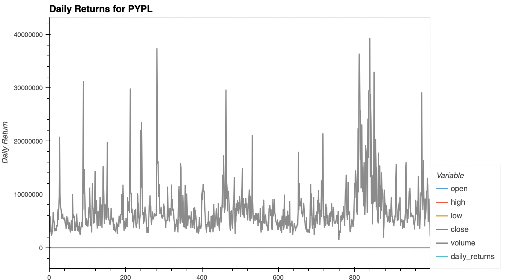
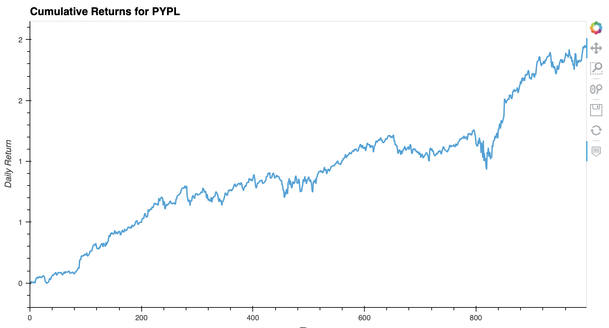

# ETF Analyzer
Financial database and web application by using SQL, Python, and the Voilà library to analyze the performance of a hypothetical fintech ETF.


## Technologies

This project was developed with python 3.7 with the following packages:

* [pandas](https://github.com/pandas-dev/pandas) - Providing fast, flexible, and expressive data structures designed to make working with "relational" or "labeled" data both easy and intuitive.

* [HoloViz (formerly PyViz)](https://pypi.org/project/hvplot/) - Data visualization tools hvPlot and GeoView.

* [Numpy](https://github.com/numpy/numpy) - NumPy offers comprehensive mathematical functions, random number generators, linear algebra routines, Fourier transforms, and more.

* [SQLAlchemy](https://github.com/sqlalchemy/sqlalchemy) - SQLAlchemy is the Python SQL toolkit and Object Relational Mapper that gives application developers the full power and flexibility of SQL. 
* 
And as well I used [Jupyter Lab](https://github.com/jupyter/notebook) notebook to develope it.

---

## Installation Guide

Before running the application it is necessary to install the following dependencies.

* pandas
```conda install pandas``` 
* Jupyter Notebook
```pip install notebook```
* hvplot
```conda install -c pyviz hvplot```
* numpy
```python -c 'import numpy; numpy.test()```
* sqlalchemy
```pip install SQLAlchemy```
---
## Usage

To use the application you will need to clone the repo into your machine, navigate on terminal into it and open your [Jupyter Lab](https://github.com/jupyter/notebook) to run the file **etf_analyzer.ipynb**. 

Bellow you can find a brief summary of the data collected through the analysis.
  |  

## Contributors

This was a project developed as a group during a Fintech Bootcamp hosted by UC Berkley Extension. 

---

## License
MIT


HAPPY CODING :) 
